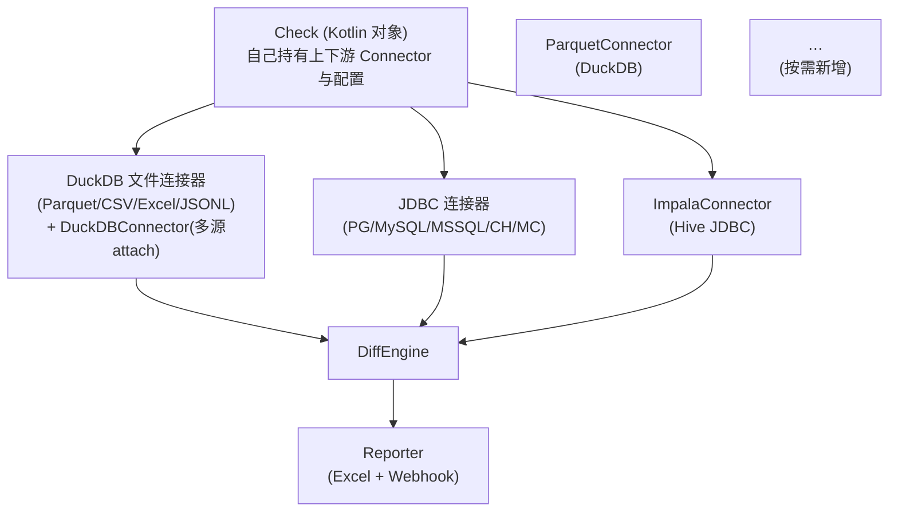
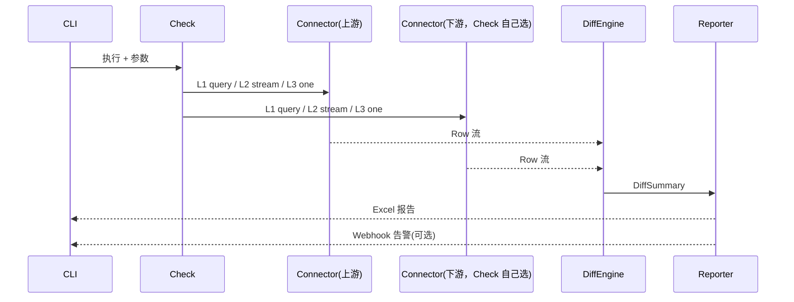

# sync_diff

> 分阶段适配上下游数据源的数据对账工具。上游 / 下游都由 Check 自己声明，框架不做兜底。

> **使用方式见 [docs/USAGE.md](docs/USAGE.md)**（命令行、写自己的 Check、字段规则、
> 新增数据源、调度集成、故障排查）。本文是设计与分阶段路线。

## 1. 核心思路

- **上下游同一套 Connector**：上游接 Parquet 用 `ParquetConnector`，下游接 Impala 用
  `ImpalaConnector`；Check 在 `Ctx.run()` 里直接 new 对应 Connector，不经过任何工厂封装。
  上游 / 下游接什么、用什么配置全在 Check 自己手里——`OrderSyncCheck` 声明双
  Parquet + Impala，再写一个 Check 想换源就直接 `IcebergRESTConnector(...)` / `PgConnector(...)`。
- **上游按需**：遇到一个源接一个。阶段 1 先接 Parquet（用 DuckDB 读），后续 JDBC 源逐个补齐。
- **新增源零侵入**：加一个实现 `Connector` 的类即可，Check 里直接用它，不动任何已有代码。
- **代码即配置**：`Check` 对象直接写 SQL 与规则，不引入 Capabilities、PushdownPlanner 之类的元数据层。

Parquet 作为起点的原因：自带完整 schema、row group 流式扫描、天然支持对象存储，跳过 JDBC 流式参数调优，先把 diff 核心跑通。自测 / CI 用 Parquet 当上下游替身也是同一理由——不必起 Impala。

## 2. 架构



## 3. 接口

只有两个核心抽象。

### 3.1 Connector

两端统一接口，小结果集走 `query()`，大表走 `stream()`，单行走 `one()`。

```kotlin
interface Connector : Closeable {
    fun query(sql: String): List<Row>      // 小结果集
    fun stream(sql: String): Sequence<Row> // 大结果集，服务端游标
    fun one(sql: String): Row?             // 单行
}
```

### 3.2 DiffEngine

```kotlin
class DiffEngine {
    fun aggregate(
        src: List<Row>,
        tgt: List<Row>,
        keys: List<String>,
        rules: FieldRules.() -> Unit = {}   // 与 compare 共用同一套规则，见下
    ): List<DiffRow>
    fun keySet(src: Sequence<Row>, tgt: Sequence<Row>, key: String): Sequence<String>
    fun compare(s: Row, t: Row, rules: FieldRules.() -> Unit): List<FieldDiff>
    fun compareRows(
        src: Sequence<Row>,
        tgt: Sequence<Row>,
        key: (Row) -> Any,
        check: (Row, Row) -> List<FieldDiff>
    )
    fun summary(): DiffSummary
}
```

`aggregate` 的 `rules` 是必需的：L1 的 `SUM(amount)` 这类度量列，如果按 `==` 精确比对，
行级允许的数值漂移会在聚合层被误报成差异。传同一套 `FieldRules` 才能让两档口径一致：

```kotlin
engine.aggregate(srcAgg, tgtAgg, keys = listOf("dt")) {
    field("s") { tolerance(abs = 0.01) }   // SUM(amount)
    // 不声明的列（count / checksum）默认 ==
}
```

等价的中缀写法：`field("s") by tolerance(abs = 0.01)`。

## 4. Kotlin 特性约定（写"Kotlin"，不写"带缩进的 Java"）

> 下面所有约定都是**默认使用**——能扩展就不用工具类，能 inline 就不要样板，能 `Sequence` 就不要 `List`，能解构 + 命名参数就不要位置参数。

### 4.1 类型与数据建模

- `Row`、`DiffRow`、`FieldDiff`、`DiffSummary` 一律 `data class`：自动 `equals/hashCode/copy/toString`。
- 校验结果用 `sealed interface FieldDiff`，子类 `Equal` / `Mismatch` / `Missing`：配合 `when` 强制穷尽。
- `Check` 用 `sealed interface` / `abstract class`，每个具体校验是 `object`（天然单例、延迟初始化）。
- 字段规则集合是 `value class` 或 `data class`，避免原始字符串散落。

```kotlin
sealed interface FieldDiff {
    data class Mismatch(val field: String, val expected: Any?, val actual: Any?) : FieldDiff
    data object Equal : FieldDiff
}

data class Row(val values: Map<String, Any?>) {
    operator fun get(name: String): Any? = values[name]
    inline fun <reified T : Any> getAs(name: String): T? = values[name] as? T
}
```

### 4.2 扩展属性 / 扩展函数：业务语义挂到原生类型上

不要写 `RowUtil.getString(row, "amount")`。直接给 `Row` 加扩展属性/操作符索引。

```kotlin
val Row.str: Map<String, Any?> get() = values
val Row.columns: Set<String> get() = values.keys

val Row.intVal:    (String) -> Int?       get() = { name -> getAs<Int>(name) }
val Row.longVal:   (String) -> Long?      get() = { name -> getAs<Long>(name) }
val Row.decimal:   (String) -> BigDecimal? get() = { name -> getAs<BigDecimal>(name) }
val Row.instant:   (String) -> Instant?   get() = { name -> getAs<Instant>(name) }
val Row.string:    (String) -> String?    get() = { name -> getAs<String>(name) }

// 操作符索引 + 安全默认值，替换所有 getOrDefault(... ?: ...)
operator fun Row.invoke(name: String, default: Any? = null): Any? =
    values[name] ?: default

// ResultSet → Row 也是扩展函数（每个 Connector 自带）
fun ResultSet.toRow(): Row = Row((1..metaData.columnCount).associate { i ->
    metaData.getColumnLabel(i) to getObject(i)
})
fun ResultSet.toRows(): List<Row> = sequence { while (next()) yield(toRow()) }.toList()
```

JDBC 客户端用 `T.runCatching` 包成 `Result<T, SQLException>` 风格的领域类型，**别**用 Java 风格的 try/catch 嵌套。

```kotlin
inline fun <T> Connection.useConnection(block: (Connection) -> T): T =
    use(block)  // Closeable.use 已是 inline

inline fun <T> PreparedStatement.useQuery(
    fetchSize: Int = 10_000,
    block: (ResultSet) -> T
): T = use { st ->
    st.fetchSize = fetchSize
    st.executeQuery().use(block)
}
```

### 4.3 lambda + 接收者（DSL）

Check、FieldRules、Reporter 全部用接收者 lambda，省掉 builder 样板。

```kotlin
@DslMarker
annotation class CheckDsl

@CheckDsl
class FieldRules(private val rules: MutableMap<String, (Any?, Any?) -> Boolean>) {
    operator fun String.invoke(rule: (Any?, Any?) -> Boolean) { rules[this] = rule }

    // DSL 助手方法全部带接收者 lambda
    fun tolerance(abs: Double = 0.0, rel: Double = 0.0): (Any?, Any?) -> Boolean = { s, t ->
        val a = (s as? Number)?.toDouble(); val b = (t as? Number)?.toDouble()
        a != null && b != null && kotlin.math.abs(a - b) <= abs + kotlin.math.abs(b) * rel
    }
    fun ignore(): (Any?, Any?) -> Boolean = { _, _ -> true }
    val toUtc: (Any?, Any?) -> Boolean = { s, t -> s == t }  // 类型归一已在 Connector 内完成
}

// 自定义扩展就是普通函数 + 接收者；不是工具类静态方法
fun FieldRules.phoneNumber(): (Any?, Any?) -> Boolean = { s, t ->
    (s as? String)?.filter(Char::isDigit) == (t as? String)?.filter(Char::isDigit)
}
fun FieldRules.amountWithTax(rate: BigDecimal): (Any?, Any?) -> Boolean = { s, t ->
    (s as? BigDecimal)?.let { it * rate } == t as? BigDecimal
}
```

`infix` 让规则声明读起来像 DSL：

```kotlin
infix fun FieldRules.field(name: String): FieldSlot = FieldSlot(this, name)
class FieldSlot internal constructor(private val rules: FieldRules, private val name: String) {
    infix fun by(check: (Any?, Any?) -> Boolean) { rules.bind(name, check) }
}

// 在 compare 的接收者作用域里，`field` 的作用对象是 FieldRules，因此字段名写在后面：
diff.compare(s, t) {
    field("amount")       by tolerance(abs = 0.01)
    field("updated_at")   by toUtc
    field("status")       by ignore()
    field("phone")        by phoneNumber()
    field("amount_taxed") by amountWithTax(BigDecimal("1.06"))
}
```

> `infix` 调用是 `a f b` ≡ `a.f(b)`；省略接收者时 `field "amount"` 等价于 `field("amount")`，
> 所以也可以写成 `field "amount" by tolerance(abs = 0.01)`。字段名不能写在 `field` 左边。

builder 写法（§11.2）与上面的中缀写法完全等价，任选一种：

```kotlin
diff.compare(s, t) {
    field("amount")     { tolerance(abs = 0.01) }
    field("updated_at") { toUtc }          // toUtc 是属性，不要加括号
}
```

### 4.4 中缀 / 操作符 / 解构

凡是有"自然语言感"的接口都用 `infix`/`operator`。

```kotlin
// "src 与 tgt" / "dt 取 2026-09-01" 这类语义
infix fun String.eq_(other: String): Boolean = this == other  // 仅示例

// Sequence 上的差集、并集用 operator 函数（自定义语义风格）改造 L2
operator fun <T> Sequence<T>.minus(other: Sequence<T>): Sequence<T> where T : Any =
    other.toHashSet().let { ex -> filter { it !in ex } }

// Row 解构：按主键直接拿
operator fun Row.component1(): Any? = values.values.firstOrNull()  // 仅示例，按主键自行实现

// 默认值场景用命名参数，避免传 7 个 null
src.query(
    sql = "SELECT count(*) c FROM read_parquet(?)",
    args = listOf(path),
    fetchSize = 10_000
)
```

### 4.5 Sequence 惰性 + Scope Function 链

`Connector.stream` 已经是 `Sequence`；后续比较器必须保持惰性，避免把上亿条抽进 `List`。

```kotlin
// L2：两端主键集合做差，O(1) 额外内存
val onlyInSrc: Sequence<String> = (srcKeys - tgtKeys.toHashSet()).asSequence()
val onlyInTgt: Sequence<String> = (tgtKeys - srcKeys.toHashSet()).asSequence()

// L3 行级：take/sampled/distinctBy 都是惰性
val sample: Sequence<Row> = srcSeq
    .filter { it.instant("updated_at")!!.isAfter(cutoff) }
    .distinctBy { it.string("order_id") }
    .sampled(ratio = 0.01)            // 自定义扩展
    .take(1000)

fun <T> Sequence<T>.sampled(ratio: Double, seed: Long = 42L): Sequence<T> = sequence {
    val rng = java.util.SplittableRandom(seed)
    forEach { if (rng.nextDouble() < ratio) yield(it) }
}
```

Scope function 用法要克制：`apply` 配构造、`also` 配副作用、`with` 配临时作用域、`let` 配 null 安全链、`use` 配资源。

```kotlin
val alertUrl = System.getenv("ALERT_URL") ?: ""      // 空串时 webhook 内部直接 no-op
val diffSummary = diff.summary().also { report.excel(path, it) }
    .let { if (it.hasDiff) report.webhook(alertUrl, it); it }
```

### 4.6 协程与结构化并发

`Connector` / `DiffEngine` 全部是同步 API，**仓库当前没有任何 Flow 使用**：`Check.run` 是
`suspend`（留给需要并发取数的 Check），CLI 用 `runBlocking` 把它桥到同步 `main`。

要在一条 Check 里并发跑两端，`coroutineScope { async { ... } }` 就够了，不必引入 Flow：

```kotlin
override suspend fun Ctx.run() = coroutineScope {
    val srcAgg = async { src.query(srcSql) }
    val tgtAgg = async { tgt.query(tgtSql) }
    diff.aggregate(srcAgg.await(), tgtAgg.await(), keys = listOf("dt"))
}
```

注意 `DiffEngine` 的计数器不是线程安全的（见 §10），并发只在「取数」这一层做，别把同一次
对账的 `aggregate` / `compareRows` 拆到多个协程里。

### 4.7 构造：命名参数 + 默认值

Connector 直接 new，不为"统一入口"再包一层工厂——多一层类就要多写一份转发代码，
而且那层类往往只持有配置、只转发构造：

```kotlin
// 上游：Parquet（DuckDB）
val src = ParquetConnector("/data/orders/dt=2026-09-01/part-0.parquet", memoryLimit = "4GB")

// 下游：Impala（连接信息由 Check 持有，env 兜底）
val tgtImpalaCfg = ImpalaConfig.fromEnv(ImpalaConfig.DEFAULT)   // IMPALA_JDBC_URL / USER / PASSWORD
val tgt = ImpalaConnector(tgtImpalaCfg)

// 下游换 Parquet 自测：同一套 Connector，一行切换
val tgtLocal = ParquetConnector("/tmp/tgt.parquet")
```

每个 Check 自己持有自己的连接配置（典型：`@Volatile var myCfg = ImpalaConfig.fromEnv(...)`）。
框架没有"全局默认下游"——Check 之间互不影响，换连接类时也不会牵动别的 Check。

"默认值"和"必填参数"用 Kotlin 的参数默认值表达，不要为组合参数再造 builder：

```kotlin
class ImpalaConnector(
    jdbcUrl: String,
    user: String? = null,
    password: String? = null,
    private val fetchSize: Int = DEFAULT_FETCH_SIZE,
) : Connector
```

一次性注册（reflection 一次，启动期完成）：

```kotlin
inline fun <reified T : Check> CheckRegistry.register() {
    register(T::class.simpleName!!, T)
}
```

### 4.8 错误处理：`Result` + 领域异常

不要抛裸 `SQLException` 一路冒泡。用 `runCatching` + 领域错误。

```kotlin
// Kotlin 的 interface 不能 extends Throwable（Throwable 是 open class），所以用 sealed class：
// when 的穷尽性与 sealed interface 等价，代价是子类共享 RuntimeException 这条继承链。
sealed class ConnectorError : RuntimeException() {
    abstract val sql: String
    data class QueryFailed(override val sql: String, override val cause: Throwable) : ConnectorError()
    data class TypeCoercion(val column: String, val from: String, val to: String) : ConnectorError() {
        override val sql get() = "<type-coercion>"
    }
}

inline fun <T> Connector.guard(sql: String, block: () -> T): T =
    runCatching(block).getOrElse { e -> throw ConnectorError.QueryFailed(sql, e) }
```

### 4.9 Check 主体：全是 Kotlin 习惯

```kotlin
object UserSyncCheck : CheckBase("user_sync") {
    @Volatile var alertUrl = System.getenv("ALERT_URL") ?: ""

    override suspend fun Ctx.run() {
        val dt = args.dt
        ParquetConnector("/data/users/dt=$dt/part-0.parquet").use { src ->
            ParquetConnector("/data/users_tgt/dt=$dt/part-0.parquet").use { tgt ->
                // L1：聚合粗筛（SUM 列挂容忍度，与 L3 同一套规则）
                diff.aggregate(
                    src.query("SELECT '$dt' AS dt, COUNT(*) AS c, SUM(amount) AS s FROM read_parquet('…')"),
                    tgt.query("SELECT '$dt' AS dt, COUNT(*) AS c, SUM(amount) AS s FROM read_parquet('…')"),
                    keys = listOf("dt"),
                ) {
                    field("s") { tolerance(abs = 0.01) }
                }

                // L2：主键集合差集（惰性；toList() 必须消费，否则 keyDiffCount 不累加）
                val onlyOneSide: List<String> = diff.keySet(
                    src = src.stream("SELECT order_id FROM read_parquet('…')"),
                    tgt = tgt.stream("SELECT order_id FROM read_parquet('…')"),
                    key = "order_id",
                ).toList()

                // L3：行级细比（ORDER BY 保证抽样子集确定）
                diff.compareRows(
                    src = src.stream("SELECT order_id, amount, updated_at, status, phone FROM read_parquet('…') ORDER BY order_id LIMIT 1000"),
                    tgt = tgt.stream("SELECT order_id, amount, updated_at, status, phone FROM read_parquet('…') ORDER BY order_id LIMIT 1000"),
                    key = { row -> row["order_id"] ?: error("missing order_id column") },
                    check = { s, t ->
                        diff.compare(s, t) {
                            field("amount")     by tolerance(abs = 0.01)
                            field("updated_at") by toUtc
                            field("status")     by ignore()
                            field("phone")      by phoneNumber()
                        }
                    },
                ).toList()
            }
        }

        val summary = diff.summary()
        report.excel("reports/user_sync_$dt.xlsx", summary)
        report.webhook(alertUrl, summary)
    }
}
```

上面用到的都是库里**真实存在**的 API：`CheckBase` / `Ctx.run` / `args.dt`、
`Connector.query` / `stream` / `one`、`DiffEngine.aggregate` / `keySet` / `compareRows` / `compare` /
`summary`、`FieldRules` 的 `field { … }` 与 `field … by …` 两种写法、`Report.excel` / `webhook`。

不要为此自造中缀工具（例如 `infix fun Connector.query(sql: String) = query(sql)` 这种自递归包装，
或 `mapBy` / `forEachParallel` 之类）：`FieldRules.field` 已经是 infix，取列值用
`row.string("x")` / `row.decimal("x")` 这类扩展属性即可；并发取数见 §4.6。

### 4.10 风格红线

| 反例（Java 风） | 正例（Kotlin 风） |
|:---|:---|
| `RowUtil.getString(row, "x")` | `row.string("x")` 扩展属性 |
| `new Builder().setA(a).setB(b).build()` | `buildList { add(a); add(b) }` / DSL |
| `for (int i = 0; i < n; i++) ...` | `(0 until n).forEach { ... }` |
| `if (x != null) { ... x ... }` | `x?.let { ... }` |
| `if (x == null) throw new IAE()` | `requireNotNull(x)` |
| `if (x is Foo) { val y = x; ... }` | `if (x is Foo) { ... }` 智能转型 |
| `try { ... } catch (Exception e) { log }` | `runCatching { ... }.onFailure { log }` |
| `instanceof Foo ? ((Foo)x).foo() : null` | `(x as? Foo)?.foo()` |
| `List<String> -> Stream<String> -> List<String>` | `Sequence` 全程保持惰性 |
| `public static final` 常量 | `const val` / `object` 单例 |
| `equals/hashCode/toString` 手写 | `data class` |
| `switch (x) { case A: ...; default: }` | `when (x) { is A -> ...; else -> ... }` |

## 5. DuckDB 文件连接器（Parquet / CSV / Excel / JSONL）+ DuckDBConnector

### 5.1 ParquetConnector

DuckDB 读 Parquet，row group 流式扫描，不依赖 JDBC 游标参数。

```kotlin
class ParquetConnector(
    private val path: String,
    private val memoryLimit: String = "1GB",
    private val tempDir: String = "/tmp/duckdb_spill",
) : DuckDbSessionConnector(memoryLimit, tempDir, httpfsFor(path))
```

> 注：生产里 `sql` 参数须用参数化预编译或经白名单校验；演示 SQL 采用字符串拼接只为简洁。

`query` / `stream` / `one` / `close` 由基类 `DuckDbSessionConnector` 实现（`guard` 失败包装、
扩展加载、服务端游标逐行 `yield`），本类只声明「读 Parquet」；`path` 只用于判断是否
`s3://` / `oss://`（决定要不要加载 httpfs），真正读哪些文件由 Check 的 SQL 决定。

### 5.2 CsvConnector

使用 DuckDB `read_csv_auto`，自动推断列类型。

```kotlin
CsvConnector("/data/orders/2026-09-01.csv").use { src ->
    src.stream("SELECT * FROM read_csv_auto('$path')").take(1000).toList()
}
```

### 5.3 ExcelConnector

使用 DuckDB `excel` 扩展读 `.xlsx`。

```kotlin
ExcelConnector("/data/orders/2026-09-01.xlsx").use { src ->
    src.stream("SELECT * FROM read_xlsx('$path')").take(1000).toList()
}
```

函数名是 `read_xlsx`（`excel` 扩展提供，另有 `sheet` / `header` / `range` 等参数），
不是 `st_read`——那是 spatial 扩展的函数。

### 5.4 JsonlConnector

使用 DuckDB 的 JSON 扩展，每行一个 JSON 对象自动解析。

```kotlin
JsonlConnector("/data/orders/2026-09-01.jsonl").use { src ->
    src.stream("SELECT * FROM read_ndjson_auto('$path')").take(1000).toList()
}
```

DuckDB 没有 `read_jsonl` 这个函数（实测 1.5.5.1 有 `read_json` / `read_json_auto` /
`read_ndjson` / `read_ndjson_auto` / `read_json_objects*` / `read_ndjson_objects`）。
按行分隔的 JSONL 用 `read_ndjson_auto`；整个文件当一个 JSON 值解析用 `read_json_auto`。

### 5.5 共享特性

所有 DuckDB 文件连接器共用同一个基类 `DuckDbSessionConnector`（不再是"各写一遍的构造模式"）：

- `jdbc:duckdb:` in-process 引擎，构造期建连，`autoCommit = false` 持有会话配置
- `memory_limit` / `temp_directory` 可配置
- 需要的扩展由子类在 super 调用里声明：S3/OSS 路径自动 `INSTALL/LOAD httpfs`，
  `ExcelConnector` 额外加载 `excel`
- `query` / `stream` / `one` / `close` 只在基类实现一次：失败一律抛 `ConnectorError.QueryFailed`
  （`guard` 写在 `sequence { }` 内部），`stream()` 服务端游标逐行 `yield`，JVM 堆只保留一行
- 每个源类只剩构造参数 + 一句 `super(...)`，加新源不会再抄一遍取数逻辑

### 5.6 交付物与周期

1 周。包含：

- `ParquetConnector`（DuckDB）、`ImpalaConnector`（Hive JDBC）——上下游共用同一套接口
- `DiffEngine`（L1 聚合 + L2 主键集合 + L3 行级）
- `FieldRules` DSL（内置规则 + 自定义扩展函数）
- `Check` 抽象 + `CheckRegistry`（连接配置由 Check 自己持有，框架不做兜底）
- `Reporter`（Excel + Webhook）
- CLI（Clikt）

### 5.7 验证点

- DuckDB 读大 Parquet 不 OOM（row group 流式 + spill）
- Impala JDBC 连接稳定
- L1/L2/L3 diff 结果正确
- 自定义规则 lambda 可扩展
- 对象存储（S3/OSS）可读

## 6. 已实现的连接器

### 6.1 DuckDB 连接器

共用同一个 `jdbc:duckdb:` in-process 引擎与同一个基类 `DuckDbSessionConnector`（实现只写一份），读文件不额外占用 JVM 堆。`DuckDBConnector` 允许用户在 `setupSql` 中附加任意外部数据源（PostgreSQL / MySQL / SQLite / 其他 DuckDB），实现跨源 SQL 查询。

| 连接器 | DuckDB 函数 | 说明 |
|:---|:---|:---|
| `ParquetConnector` | `read_parquet` | Parquet 文件，row group 流式 |
| `CsvConnector` | `read_csv_auto` | CSV / TSV，自动推断类型 |
| `ExcelConnector` | `read_xlsx`（excel 扩展） | `.xlsx`，需 `INSTALL/LOAD excel` |
| `JsonlConnector` | `read_ndjson_auto` | JSONL（每行一个 JSON 对象） |
| `DuckDBConnector` | 用户自定义 `ATTACH` | 多数据源 `ATTACH`（PG/MySQL/SQLite/DuckDB），跨源 SQL 查询 |

S3/OSS：路径含 `s3://` / `oss://` 时自动 `INSTALL/LOAD httpfs`。

### 6.2 JDBC 连接器

共用同一个基类 `JdbcConnector`：`query` / `stream` / `one` / `close` 只实现一份，失败一律抛
`ConnectorError.QueryFailed`（**含 `stream`**），各源只负责建连与方言差异（`one()` 的 `LIMIT 1`
在 SQL Server 上换成 `SELECT TOP 1`）。每个连接器在建连前显式 `Class.forName(自己的驱动)`，
不依赖 fat jar 里被合并的 `META-INF/services/java.sql.Driver`——那条链一旦有驱动加载不了，
排在它后面的全失效。

| 连接器 | JDBC URL 前缀 | 关键参数 | 陷阱 |
|:---|:---|:---|:---|
| `ImpalaConnector` | `jdbc:hive2://` | `autoCommit=false` + `fetchSize=10000` | 驱动是 `hive-jdbc:4.1.0:standalone`（见 §13）；Kerberos 票据需预先存在 |
| `PgConnector` | `jdbc:postgresql://` | `autoCommit=false` + `fetchSize=10000` | 不关 autoCommit 会全量拉回 |
| `MySQLConnector` | `jdbc:mysql://` | `autoCommit=false` + `fetchSize=10000` | **URL 必须带 `useCursorFetch=true`**，否则驱动全量拉回 |
| `MSSQLConnector` | `jdbc:sqlserver://` | `autoCommit=false` + `fetchSize=10000` | 默认全缓冲 |
| `ClickHouseConnector` | `jdbc:clickhouse://` | `autoCommit=false` + `fetchSize=10000` | — |
| `MaxComputeConnector` | `jdbc:odps:` | 无事务，JDBC 直连 | 类型映射非标准 |
| `H2Connector` | `jdbc:h2:` | 嵌入式或远程 | 仅供测试 |

## 7. Check 示例（阶段 1）

```kotlin
object OrderSyncCheck : CheckBase("order_sync"), Alertable {
    @Volatile var parquetPath = System.getenv("ORDERS_PARQUET_PATH") ?: "/tmp/orders.parquet"
    @Volatile var tgtParquetPath = System.getenv("ORDERS_TGT_PARQUET_PATH") ?: parquetPath
    @Volatile override var alertUrl = System.getenv("ALERT_URL") ?: ""

    override suspend fun Ctx.run() {
        val dt = args.dt
        ParquetConnector(parquetPath).use { s ->
            ParquetConnector(tgtParquetPath).use { t ->
                // L1 聚合：行数、金额和、主键哈希和；SUM 列必须挂容忍度，否则行级容忍的漂移会在 L1 误报
                val srcAgg = s.query(
                    "SELECT '$dt' AS dt, COUNT(*) AS c, SUM(amount) AS s, " +
                        "SUM(hash(order_id)) AS h FROM read_parquet('$parquetPath')"
                )
                val tgtAgg = t.query(
                    "SELECT '$dt' AS dt, COUNT(*) AS c, SUM(amount) AS s, " +
                        "SUM(hash(order_id)) AS h FROM read_parquet('$tgtParquetPath')"
                )
                diff.aggregate(srcAgg, tgtAgg, keys = listOf("dt")) {
                    field("s") { tolerance(abs = 0.01) }
                }

                // L2 主键集合差集：序列必须消费（toList / forEach），否则 keyDiffCount 不累加
                val onlyOneSide: List<String> = diff.keySet(
                    src = s.stream("SELECT order_id FROM read_parquet('$parquetPath')"),
                    tgt = t.stream("SELECT order_id FROM read_parquet('$tgtParquetPath')"),
                    key = "order_id",
                ).toList()

                // L3 行级：ORDER BY 让抽样子集确定；key 取不到直接失败（缺列 / NULL 主键不静默跳过）
                diff.compareRows(
                    src = s.stream(
                        "SELECT order_id, amount, status FROM read_parquet('$parquetPath') " +
                            "ORDER BY order_id LIMIT 1000"
                    ),
                    tgt = t.stream(
                        "SELECT order_id, amount, status FROM read_parquet('$tgtParquetPath') " +
                            "ORDER BY order_id LIMIT 1000"
                    ),
                    key = { row -> row["order_id"] ?: error("missing order_id column") },
                    check = { a, b ->
                        diff.compare(a, b) {
                            field("amount")     { tolerance(abs = 0.01) }
                            field("updated_at") { toUtc }      // toUtc 是属性，不加括号
                            field("status")     { ignore() }
                            field("phone")      { phoneNumber() }
                        }
                    },
                ).toList()
            }
        }

        val summary = diff.summary()
        report.excel("reports/order_sync_$dt.xlsx", summary)
        report.webhook(alertUrl, summary)   // alertUrl 为空串时内部直接 no-op
    }
}
```

## 8. 没有工厂层

`Connector` 就是唯一抽象，Check 里直接 new 具体实现：

```kotlin
// 阶段 1：上下游连接信息由 Check 自己持有（典型 `@Volatile var cfg = ImpalaConfig.fromEnv(...)`）
val src = ParquetConnector("/data/orders/dt=2026-09-01/part-0.parquet")   // DuckDB
val tgt = ImpalaConnector(myImpalaConfig)                                // Hive JDBC

// 阶段 2+
val srcPg = PgConnector(PgConfig("jdbc:postgresql://host:5432/orders"))
```

不设 `ConnectorFactory` 之类的"统一入口"：那种类最终只会是一堆
`fun x(...) = XConnector(...)` 的转发方法，调用方多绕一层，收益为零。
新增源 = 写一个实现 `Connector` 的类 + 在 Check 里 new 它，同样零侵入。

需要按配置在运行时选源时，在 Check 里写 `when` 即可——选择逻辑属于业务，不属于连接器。

## 9. 类型归一

每个 Connector 在 `rs.toRow()` 内做归一，外部一律 `Instant` / `BigDecimal` / `String(UTF-8)`。

| 源类型 | 归一到 | 说明 |
|:---|:---|:---|
| Parquet `TIMESTAMP` | `Instant(UTC)` | Parquet 自带 schema，归一最简 |
| Parquet `DECIMAL` | `BigDecimal` | 保精度 |
| PG `TIMESTAMPTZ` | `Instant(UTC)` | 带偏移型按其自身偏移归一 |
| MySQL `DATETIME` | `Instant(UTC)` | naive 型一律**按 UTC 解释**（不吃 JVM 默认时区） |
| MSSQL `DATETIMEOFFSET` | `Instant(UTC)` | 带偏移归一 |
| MaxCompute `DATETIME` | `Instant(UTC)` | 同上：naive 按 UTC 解释，**不做 +8 转换** |
| 字符串 | `String(UTF-8)` | 统一编码 |
| NULL | `null` | 统一 |

## 10. 内存控制

- **Parquet 侧**：DuckDB `read_parquet` 按 row group 流式扫描；`memory_limit` + `temp_directory` 兜底 spill。
- **JDBC 侧**：所有 `stream()` 走服务端游标、逐行 `Sequence yield`；`query()` 只用于小结果集。
- **DiffEngine**（与 `DiffEngine` 的 KDoc、各档签名一致）：
  - L1 `aggregate(List<Row>, List<Row>)`：两侧聚合结果全量物化成 `Map`，额外内存 O(分区数)。
  - L2 `keySet(Sequence<Row>, Sequence<Row>)`：两侧各扫一遍、去重后进 `LinkedHashSet`，
    额外内存 O(两端去重键数之和)。键基数极大时先用 SQL 的 `WHERE hash(k) % 100 < n` 压量。
  - L3 `compareRows(Sequence<Row>, Sequence<Row>)`：`src` 整条流进 `HashMap`（O(src 行数)），
    外加 tgt 去重键集合（O(tgt 去重键数)）。适合「一侧可控、一侧很大」。
  - 没有「差异样本 top-N 有界队列」这类结构：差异是惰性 `Sequence`，保留多少由调用方
    `take(n)` / `toList()` 决定。

## 11. 自定义校验

### 11.1 字段规则（扩展函数）

```kotlin
// 约定：规则就是 (Any?, Any?) -> Boolean 的 lambda（src 值, tgt 值）→ 是否算相等；
// 扩展函数挂在 FieldRules 上只是为了名字与发现性，仓库里的 phoneNumber / amountWithTax 就这么写。
fun FieldRules.phoneNumber(): (Any?, Any?) -> Boolean = { s, t ->
    (s as? String)?.filter(Char::isDigit) == (t as? String)?.filter(Char::isDigit)
}

fun FieldRules.amountWithTax(rate: BigDecimal): (Any?, Any?) -> Boolean = { s, t ->
    val a = s as? BigDecimal
    val b = t as? BigDecimal
    a != null && b != null && a.multiply(rate).compareTo(b) == 0
}
```

### 11.2 使用

```kotlin
diff.compare(s, t) {
    field("amount")       { tolerance(abs = 0.01) }
    field("updated_at")   { toUtc }        // toUtc 是属性（val），不加括号
    field("status")       { ignore() }
    field("phone")        { phoneNumber() }
    field("amount_taxed") { amountWithTax(BigDecimal("1.06")) }
    field("order_id")     { custom { a, b -> a?.toString()?.lowercase() == b?.toString()?.lowercase() } }
}
```

### 11.3 整行校验

```kotlin
diff.compareRows(
    src = srcStream,
    tgt = tgtStream,
    key = { it["order_id"] ?: error("missing order_id") },
    check = { s, t ->
        val expected = s.decimal("amount")?.multiply(BigDecimal("1.06"))
        val actual = t.decimal("amount_taxed")
        if (expected?.compareTo(actual) == 0) {
            listOf(FieldDiff.Equal)
        } else {
            listOf(FieldDiff.Mismatch("amount_taxed", expected, actual))
        }
    },
).toList()
```

`FieldDiff` 是 `sealed interface`（`Equal` / `Mismatch(field, expected, actual)` /
`Missing(field, side)`），没有位置参数构造；`compareRows` 的 `check` 是命名参数
`(Row, Row) -> List<FieldDiff>`，不是尾随 lambda。

## 12. 数据流



## 13. 技术栈

| 层 | 选型 | 版本 |
|:---|:---|:---|
| 语言 | Kotlin JVM | 2.4.20 |
| JDK | 编译 / 运行 / 构建 JVM | 17（Gradle 9 本身要求 ≥17，构建前 `JAVA_HOME` 必须指向 JDK 17） |
| 构建 | Gradle 多模块 + Shadow Fat JAR | Gradle 9.7.1 + Shadow 9.6.1 |
| CLI | Clikt | 5.1.0 |
| 并发 | Kotlin 协程（仅 CLI 的 `runBlocking`；无 Flow） | kotlinx-coroutines 1.11.0 |
| 上游阶段 1 | DuckDB JDBC 读 Parquet | duckdb_jdbc 1.5.5.1 |
| 下游 | Impala（HiveServer2 协议） | `hive-jdbc:4.1.0:standalone`（见下） |
| 上游阶段 2+ | 各源 JDBC 驱动 | — |
| 报告 | Excel / Webhook | Excel 由 `XlsxWriter` 手写最小 OOXML（`java.util.zip`），零额外依赖；Webhook 用 JDK `HttpURLConnection` |
| 调度 | Airflow / DolphinScheduler 触发 CLI | — |

> Fat JAR 关掉了重复条目的严格失败（`failOnDuplicateEntries = false`）：同名 class 在多个 transitive
> 里各带一份（kotlin-stdlib、lz4-java…）内容一致，运行时不存在冲突；法务元数据
> （`META-INF/LICENSE|NOTICE|DEPENDENCIES`）用 `append(...)` 追加合并而非丢弃。
>
> **Hive JDBC 必须停在 `4.1.0:standalone`**（不是 4.2.x）：4.2.x 的 `HiveDriver` 是 Java 21
> 字节码，JDK 17 上直接 `UnsupportedClassVersionError`；更麻烦的是它在合并后的
> `META-INF/services/java.sql.Driver` 里排第二，驱动注册扫描会在那条中断，导致 JDK 17 下
> H2 / MySQL / MSSQL / PG / ClickHouse / MaxCompute 全部报 "No suitable driver found"。
> `standalone` 变体也是必需的：hive-jdbc 普通 jar 的 POM 只声明 test 依赖，手工拼
> `hive-service-rpc` / `hive-service` / `hive-common` / `hadoop-client-*` 会一路漏类（thrift、
> TCLIService、HiveSQLException、HiveConf、`org.apache.hadoop.shaded.*`、curator…）。代价是这个
> jar 约 48 MB / 4.5 万条目，所以 `shadowJar` 开了 `isZip64 = true`。另外每个 JDBC 连接器都会在
> 建连前 `Class.forName(自己的驱动)`，任何驱动加载不了都不会再连带弄坏其它驱动。

## 14. 实施计划

| 阶段 | 内容 | 新增代码 | 周期 |
|:---:|:---|:---|:---:|
| 1 | Parquet + Impala + DiffEngine + FieldRules + CLI | `ParquetConnector`、`ImpalaConnector` | 1 周 |
| 2 | DuckDB 文件源（CSV / Excel / JSONL） | `CsvConnector`、`ExcelConnector`、`JsonlConnector` | 1 天 |
| 3 | JDBC 源 | `PgConnector`、`MySQLConnector`、`MSSQLConnector`、`ClickHouseConnector`、`MaxComputeConnector`、`H2Connector` | 1 周 |
| 4+ | 按需 | 每源一文件 | 按需 |

每个阶段只新增 `Connector`，不改已有代码。

## 15. 风险

| 风险 | 等级 | 缓解 |
|:---|:---:|:---|
| 采样一致性（两端哈希不同） | 高 | 在程序侧统一哈希，或两端使用可对齐表达式 |
| JDBC 源类型归一 bug | 高 | Parquet 起步降低首版风险；上线前用真实数据集回归 |
| JDBC 流式行为差异 | 中 | 每个源按 §6 参数单独验证，不能套用其他源 |
| 调度与连接生命周期 | 中 | Connector 实现 `Closeable`；由 Check 统一管理 |
| SQL 注入（字符串拼接示例） | 中 | 生产中所有动态值必须参数化或经白名单校验 |

**难度分布**：Check / Connector / DiffEngine ≈★★☆；FieldRules DSL ≈★★☆；ParquetConnector ≈★☆☆；类型归一（JDBC）≈★★★★；采样一致性 ≈★★★★。

## 16. 目录

Gradle 多模块，依赖方向单向：`app → checks → core`。

| 模块 | 职责 | 主要依赖 |
|:---|:---|:---|
| `core` | 对账内核：Row / DiffEngine / Connector / FieldRules / Reporter | Kotlin、协程、DuckDB JDBC、Impala JDBC |
| `checks` | Check 抽象与注册表 + 具体对账（`OrderSyncCheck`） | `core`、kotlin-reflect |
| `app` | CLI 入口 + Shadow Fat JAR（可执行产物） | `checks`、`core`、Clikt |

```
sync_diff/
├── settings.gradle.kts                  # include("core") / "checks" / "app"
├── gradle.properties
├── docs/USAGE.md                        # 使用手册
├── core/
│   ├── build.gradle.kts
│   └── src/
│       ├── main/kotlin/com/kxxnzstdsw/sync_diff/
│       │   ├── core/         # Row / FieldDiff / DiffRow / DiffSummary / Connector
│       │   │                 # ConnectorError / FieldRules(DSL) / SequenceExt
│       │   ├── engine/       # DiffEngine（L1 聚合 / L2 主键集合 / L3 行级）
│       │   ├── connectors/   # 基类: DuckDbSessionConnector / JdbcConnector
│       │   │                 # DuckDB 文件源: Parquet/Csv/Excel/Jsonl/DuckDB；JDBC 源: Impala/Pg/MySQL/MSSQL/ClickHouse/MaxCompute/H2
│       │   │                 # ResultSetExt（类型归一）
│       │   └── reporter/     # Reporter（Excel + Webhook）
│       └── test/kotlin/com/kxxnzstdsw/sync_diff/    # 与 main 同构
├── checks/
│   ├── build.gradle.kts
│   └── src/
│       ├── main/kotlin/com/kxxnzstdsw/sync_diff/
│       │   ├── check/        # Check / Ctx / CheckBase / Alertable / CheckRegistry / BuiltinCheck
│       │   └── checks/       # 具体对账：OrderSyncCheck（@BuiltinCheck，启动期注解扫描注册）
│       └── test/kotlin/com/kxxnzstdsw/sync_diff/    # 与 main 同构
└── app/
    ├── build.gradle.kts      # shadowJar + Main-Class 在这里
    └── src/main/kotlin/com/kxxnzstdsw/sync_diff/Main.kt   # SyncDiffCli（Clikt 入口）
```

> 三个模块统一用 `src/main/kotlin`；根 `build.gradle.kts` 集中声明 Kotlin 插件版本、toolchain 17、
> 仓库与 `useJUnitPlatform()`，各模块只保留自己的依赖。
>
> 可执行产物在 `app/build/libs/sync_diff-all.jar`（不是根目录的 `build/libs`）。

阶段 1 的实现已经跑通：

```bash
# 构建 JVM 必须是 JDK 17（Gradle 9 要求 ≥17）
export JAVA_HOME=/path/to/jdk-17

./gradlew build shadowJar
java -jar app/build/libs/sync_diff-all.jar --check order_sync --dt 2026-09-20

# 只跑某个模块的测试
./gradlew :core:test :checks:test
```

上游路径由 `ORDERS_PARQUET_PATH` / `ORDERS_TGT_PARQUET_PATH` 控制（`OrderSyncCheck` 阶段 1
两端都走 Parquet 以便零依赖自测；生产要把下游换成 Impala，去 `OrderSyncCheck.defaultConnectors()`
里替换 Connector、或在 `OrderSyncCheck.injected` 上注入一对目标 Connector）。